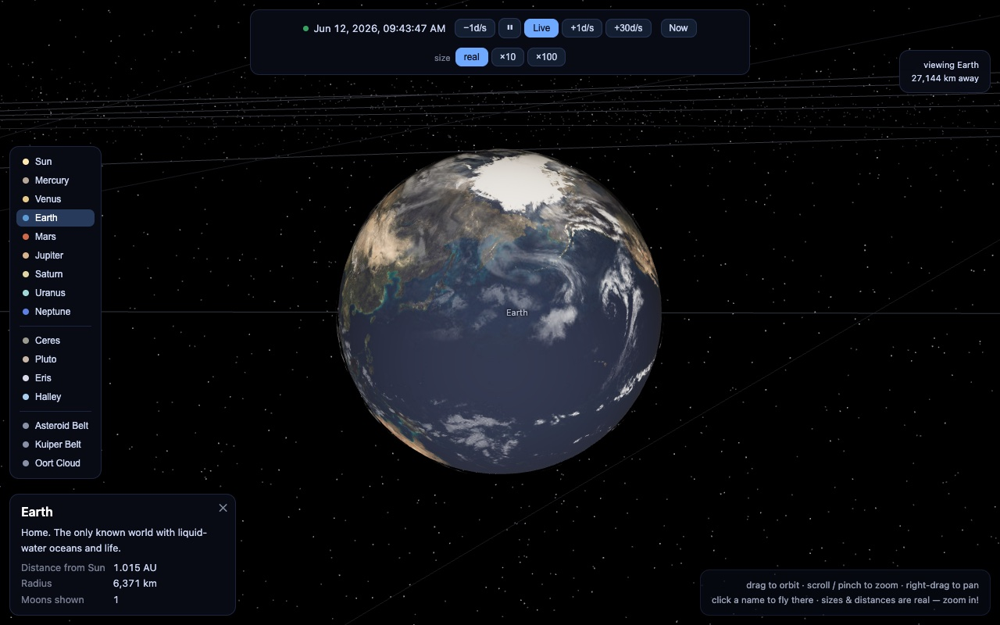

# Stargazer

**▶ Live: [nicosandller.github.io/stargazer](https://nicosandller.github.io/stargazer/)**

[](https://nicosandller.github.io/stargazer/?focus=Earth&dist=26000)

An explorable, real-time **3D** model of the solar system in a single HTML page (Three.js loaded from CDN — no build step).

Everything is at **true scale**: real planet/moon sizes, real distances. Planets are placed using JPL's approximate Keplerian elements (valid 1800–2050 AD) in full 3D — including orbital inclination — computed for the visitor's current clock time. Moons use mean circular orbits in their planet's equatorial plane (visualization-grade).

Lighting is physical: a point light at the Sun gives every body its correct day/night terminator, and a focused shadow camera renders true cast shadows in whichever planet system you visit — Saturn's shadow on its rings, moon eclipse shadows on Jupiter.

Beyond the planets and their moons it includes Ceres, Pluto, Eris, and Halley's Comet (all on real Keplerian orbits), plus the asteroid belt, the Kuiper belt, and the inner Oort cloud as particle fields. Earth uses NASA Blue Marble imagery (via the three.js repo) with a real cloud layer, and rotates in real time: its orientation is computed from the Earth Rotation Angle (IAU 2000) about its true 23.44°-tilted axis, so the hemisphere facing the Sun is correct for the simulated moment.

## Rocket launch simulation

The 🚀 panel (top right) flies missions from any launch site: set launch time, pad latitude/longitude, azimuth, parking-orbit altitude, and duration. The ascent climbs into a parking orbit, then the trajectory is integrated numerically (RK4) under Earth + Moon + Sun gravity. With **Fly to the Moon** enabled, the translunar injection burn is auto-targeted and then refined against the real propagator for a free-return trajectory — a close lunar flyby that comes back to an Earth reentry; **Auto launch window** also tries shifting the launch time (±12 h) into the plane-aligned window and keeps whichever flies better. The panel reports the computed burn, closest lunar approach, and reentry time. After splashdown the capsule rides the rotating Earth at its landing point, and if a mission is still flying past its set duration the integration extends on demand. **Load Artemis II** fills in the real mission: night launch from Kennedy LC-39B into a free-return trip around the Moon (the computed TLI ΔV of ~3.1 km/s matches the real mission). A small SLS-style rocket follows the path; click it for live altitude, speed, and Moon distance. Visualization-grade physics, not mission-grade.

## Controls

A sidebar lists every major body and region — click to fly there.

- **Drag** to orbit the view, **scroll / pinch** to zoom, **right-drag** to pan
- **Click** a body (or its name) to fly there and see details
- Time-warp buttons speed up, reverse, or pause time; **Now** snaps back to the present
- Deep links: `?focus=Saturn` (optionally `&dist=500000` in km) opens the page flying to that body, arriving on its sunlit side
- `size` buttons can exaggerate body sizes ×10 / ×100 for easier sightseeing (distances stay real)

## Credits

- Earth surface & clouds: NASA Blue Marble (via the [three.js](https://github.com/mrdoob/three.js) examples)
- All other planet, moon, and ring textures: [Solar System Scope](https://www.solarsystemscope.com/textures/) (CC BY 4.0, based on NASA imagery; Ceres and Eris maps are artistic impressions)
- Pluto & Charon: NASA / JHUAPL / SwRI New Horizons maps (via Wikimedia Commons; their unmapped southern regions appear dark)

## Run locally

Serve it (ES modules need http):

```sh
python3 -m http.server 4173
```
